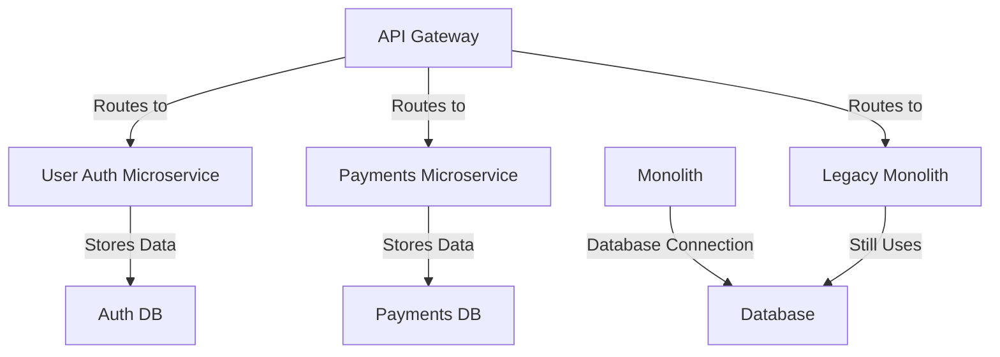
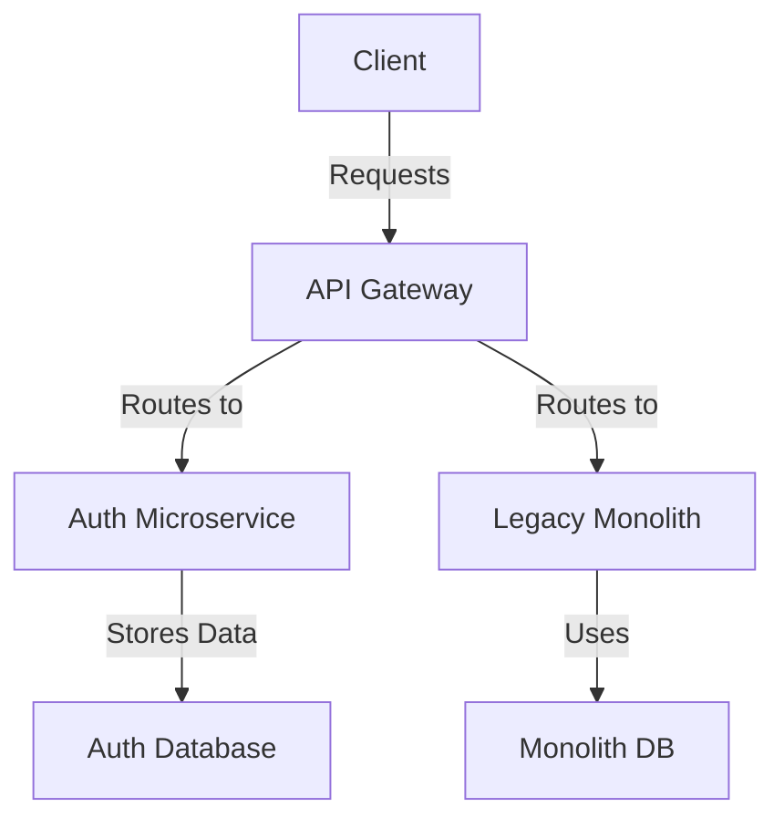

### Introduction
Legacy monolithic applications often become bottlenecks—difficult to scale, costly to maintain, and resistant to change. However, a complete rewrite is risky, expensive, and time-consuming. The **Strangler Fig Pattern** offers a safe, incremental approach to modernizing applications by gradually replacing monolith components with microservices. Instead of a disruptive 'big bang' rewrite, this method enables a **zero-downtime migration**, reducing risk while ensuring business continuity.

---

### 1. What Is the Strangler Fig Pattern?
#### Inspired by Nature 🌱
The pattern takes inspiration from the strangler fig tree, which grows around a host tree and eventually replaces it. Similarly, new microservices are introduced alongside a monolith, gradually taking over its functionality.

#### Before vs. After Migration



---

### 2. How It Works: Step-by-Step Migration
#### **Phase 1: Identify Extractable Modules**
Start by identifying loosely coupled features that can be extracted with minimal impact. Avoid migrating core business logic initially to minimize risk.

| Module          | Complexity | Risk  | Priority |
|----------------|------------|--------|----------|
| User Auth      | Low        | Low    | High     |
| Payment Gateway | Medium    | Medium | Medium   |
| Order History  | High       | High   | Low      |

#### **Phase 2: Implement API Gateway for Traffic Routing**
Set up an **API Gateway** (e.g., Kong, AWS API Gateway, Traefik, or Nginx) to dynamically route requests between the monolith and new microservices.

```yaml
# Example Kong API Gateway configuration
- name: auth-route
  paths: ['/auth']
  service: auth-service
- name: legacy-route
  paths: ['/']
  service: legacy-monolith
```

#### **Phase 3: Extract & Deploy Microservices**
For example, migrating the **User Authentication** module:

🔹 **Before Migration (Monolith):**
```http
POST /auth/login
Host: monolith.example.com
```

🔹 **After Migration (Microservice-Based):**
```http
POST /auth/login
Host: auth-service.example.com
```

#### **Updated Architecture**


#### **Phase 4: Gradually Shift Traffic & Monitor**
Use strategies like **canary deployments, feature flags, or blue-green deployments** to safely transition traffic.

| Phase | % Requests to Microservice | Monitoring Focus |
|-------|----------------------------|------------------|
| 1     | 10%                        | Latency, Errors  |
| 2     | 50%                        | Performance      |
| 3     | 100%                       | Full Cutover     |

📊 Tools for Monitoring: **Prometheus, Grafana, Jaeger**

#### **Phase 5: Repeat Until Monolith Is Decommissioned**
Continue extracting services (e.g., Payments, Inventory) until the legacy monolith is fully retired.

---

### 3. Real-World Examples
✅ **Amazon** - Originally, Amazon’s shopping cart and order processing were part of a monolith. Using the Strangler Fig Pattern, they incrementally extracted services like **recommendations, checkout, and payments**, enabling them to operate at **hyper-scale with thousands of services**.

✅ **Netflix** - Initially built as a **data center monolith**, Netflix migrated functionalities to **AWS-based microservices**, ensuring zero-downtime migration while improving scalability.

✅ **Spotify** - Spotify transitioned from a monolithic architecture to a **microservices-based system** by decoupling components like music recommendations, playlist management, and user authentication.

✅ **eBay** - Migrated core functionalities like **search, payments, and user profiles** from a monolith to microservices over time, improving scalability and deployment flexibility.

---

### 4. Common Challenges & Solutions
| Challenge               | Solution                           |
|-------------------------|-----------------------------------|
| Data Consistency        | Event Sourcing (e.g., Kafka)      |
| Dependency Hell         | API Contracts (e.g., OpenAPI)     |
| Performance Issues      | Caching & Load Balancing          |
| Testing Complexity      | Contract Testing (e.g., Pact)     |

---

### 5. Conclusion 🎯
The **Strangler Fig Pattern** provides a **proven, incremental approach** to modernizing legacy systems. By replacing one module at a time, teams can **minimize risk while ensuring business continuity** in their journey toward a **microservices-based architecture**.

#### **Next Steps:**
✅ Identify a low-risk module for extraction.
✅ Set up an API Gateway for dynamic routing.
✅ Start small, monitor results, and iterate.

🚀 **Need help?** Consider tools like **Kong, Istio, or AWS App Mesh** for smoother migrations.

---

### Further Reading & Resources 📚
- [Martin Fowler’s Strangler Fig Pattern](https://martinfowler.com/bliki/StranglerFigApplication.html)
- [AWS Microservices Best Practices](https://aws.amazon.com/microservices/)
- [Netflix Tech Blog](https://netflixtechblog.com/)

